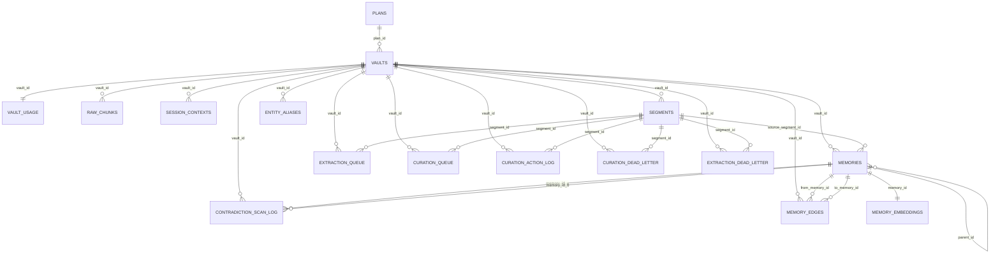

# Persistio Data Model

## Overview

Persistio is a vault-scoped schema. Nearly every application table keys data by `vault_id`, making a vault the tenant boundary for raw data, memories, aliases, queues, and usage.

The schema is created incrementally by migrations in `packages/server/src/db/migrations`.

## Entity Relationship Diagram

## Tables

### `schema_migrations`

Tracks applied SQL migration filenames.

| Column | Type | Constraints | Purpose |
| --- | --- | --- | --- |
| `filename` | `text` | PK | Applied migration filename |
| `applied_at` | `timestamptz` | not null, default `now()` | Migration timestamp |

### `plans`

Plan catalog used by vaults and quota enforcement.

| Column | Type | Constraints | Purpose |
| --- | --- | --- | --- |
| `id` | `text` | PK | Plan id; public/self-host deployments seed `unlimited` |
| `limits` | `jsonb` | not null, default `{}` | Plan quotas and caps |

### `vaults`

Tenant root record.

| Column | Type | Constraints | Purpose |
| --- | --- | --- | --- |
| `id` | `uuid` | PK, default `gen_random_uuid()` | Vault id |
| `name` | `text` | not null | Human-readable vault name |
| `api_key_hash` | `text` | not null | SHA-256 hash of vault API key |
| `created_at` | `timestamptz` | default `now()` | Creation timestamp |
| `settings` | `jsonb` | default `{}` | Vault settings, including embedding dimensions |
| `account_id` | `uuid` | nullable | External account reference |
| `encrypted_dek` | `text` | nullable | Base64 wrapped per-vault DEK |
| `vault_encryption_enabled` | `boolean` | not null, default `false` | Per-vault encryption flag |
| `plan_id` | `text` | not null, FK `plans(id)`, default `free` | Billing/feature plan |
| `purpose` | `text` | nullable | Vault-specific context injected into extraction |
| `type` | `text` | nullable, check `general`, `custom` | Prompt-selection type; unset falls back to general prompts |
| `custom_extraction_prompt` | `text` | nullable, stores validated plaintext up to 64KB before encryption | Owner-supplied extraction prompt for `custom` vaults, encrypted when vault encryption is active |
| `custom_curation_prompt` | `text` | nullable, stores validated plaintext up to 24KB before encryption | Owner-supplied curation prompt for `custom` vaults, encrypted when vault encryption is active; capped below curator input budget to preserve candidate/context room |
| `rate_limit_override` | `jsonb` | nullable | Per-vault override for quota/rate limits, including provider-neutral AI budget fields |

Design notes:

- vault-per-tenant is the primary isolation model
- `plan_id` is a real FK to `plans`
- encryption is opt-in per vault even when global encryption support is enabled
- `type='custom'` is gated by API validation to `standard` or `unlimited` plans and requires both custom prompts to pass static safety/schema validation before encrypted storage

### `vault_usage`

Single usage row per vault for the current period.

| Column | Type | Constraints | Purpose |
| --- | --- | --- | --- |
| `vault_id` | `uuid` | PK, FK `vaults(id)` on delete cascade | Vault reference |
| `period` | `text` | not null | Billing/usage month in `YYYY-MM` |
| `ingest_events` | `int` | not null, default `0` | Monthly ingest count |
| `memory_adds` | `int` | not null, default `0` | Monthly memory creation count |
| `searches` | `int` | not null, default `0` | Monthly recall count |
| `updated_at` | `timestamptz` | default `now()` | Last usage mutation |

Design note:

- `vault_usage` is intentionally one-row-per-vault, overwritten as the current period advances
- historical billing/reporting usage belongs to the Persistio App D1 store, populated by durable platform period-close events

### `raw_chunks`

Raw conversation events ingested from clients.

| Column | Type | Constraints | Purpose |
| --- | --- | --- | --- |
| `id` | `uuid` | PK, default `gen_random_uuid()` | Chunk id |
| `vault_id` | `uuid` | not null, FK `vaults(id)` on delete cascade | Vault reference |
| `session_id` | `text` | not null | Client session key |
| `role` | `text` | not null | `user`, `assistant`, or `tool` |
| `content` | `text` | nullable during development migration only | Temporary source column for one-time blob migration; runtime reads use blob fields |
| `blob_store` | `text` | nullable until migrated | Raw chunk storage backend, currently `local` or `azure_blob` |
| `blob_key` | `text` | nullable until migrated | Object key/path for the stored raw or encrypted chunk text |
| `blob_migrated_at` | `timestamptz` | nullable | Timestamp set by the one-time migration script |
| `content_sha256` | `text` | nullable | Checksum captured when migrating existing DB content to object storage |
| `embedding` | configurable `vector(n)` | nullable | Chunk embedding. Self-host Qwen default is `vector(1024)`; legacy OpenAI installs commonly use `vector(1536)`. |
| `created_at` | `timestamptz` | default `now()` | Original conversation turn timestamp supplied by ingest request |
| `processed` | `boolean` | default `false` | Extraction completion marker |

Indexes:

- `idx_raw_chunks_vault_processed` on `(vault_id, processed)`
- `idx_raw_chunks_blob_missing` on `(id)` where `blob_key IS NULL AND content IS NOT NULL`
- `idx_raw_chunks_blob_key` on `(blob_store, blob_key)` where `blob_key IS NOT NULL`

### `raw_chunk_blob_deletion_queue`

Durable cleanup queue for raw chunk blobs whose owning vault has been deleted. Rows intentionally do not reference `vaults`, because they must survive the vault delete until object storage cleanup succeeds.

| Column | Type | Constraints | Purpose |
| --- | --- | --- | --- |
| `id` | `uuid` | PK, default `gen_random_uuid()` | Cleanup row id |
| `vault_id` | `uuid` | not null | Deleted vault id |
| `blob_store` | `text` | not null, unique with `blob_key` | Storage backend |
| `blob_key` | `text` | not null, unique with `blob_store` | Object key/path to delete |
| `queued_at` | `timestamptz` | not null, default `now()` | Cleanup enqueue time |
| `deleted_at` | `timestamptz` | nullable | Set after object deletion succeeds |
| `last_error` | `text` | nullable | Last cleanup failure, if retry is needed |

Indexes:

- `idx_raw_chunk_blob_deletion_queue_pending` on `(vault_id, queued_at)` where `deleted_at IS NULL`

### `session_contexts`

One summarized context per vault/session pair.

| Column | Type | Constraints | Purpose |
| --- | --- | --- | --- |
| `id` | `uuid` | PK, default `gen_random_uuid()` | Row id |
| `vault_id` | `uuid` | not null, FK `vaults(id)` on delete cascade | Vault reference |
| `session_id` | `text` | not null | Session id |
| `context` | `text` | not null | Extracted or encrypted session summary |
| `extracted_at` | `timestamptz` | not null, default `now()` | Summary creation time |

Constraints and indexes:

- unique `(vault_id, session_id)`
- index `idx_session_contexts_vault_session`

### `segments`

Conversation chunk groups used as extraction units.

| Column | Type | Constraints | Purpose |
| --- | --- | --- | --- |
| `id` | `uuid` | PK, default `gen_random_uuid()` | Segment id |
| `vault_id` | `uuid` | not null, FK `vaults(id)` on delete cascade | Vault reference |
| `session_id` | `text` | not null | Session id |
| `chunk_ids` | `uuid[]` | not null, default `{}` | Ordered chunk ids in this segment |
| `context` | `text` | nullable | Short preview context, encrypted if needed |
| `created_at` | `timestamptz` | not null, default `now()` | Segment creation time |

Index:

- `idx_segments_vault_session` on `(vault_id, session_id, created_at)`

### `extraction_queue`

Work queue for extraction jobs.
During the raw chunk blob migration, workers only claim queue rows whose referenced raw chunks all have `blob_key` values.

| Column | Type | Constraints | Purpose |
| --- | --- | --- | --- |
| `id` | `uuid` | PK, default `gen_random_uuid()` | Queue row id |
| `chunk_id` | `uuid` | nullable, FK `raw_chunks(id)` | Legacy single-chunk work source |
| `vault_id` | `uuid` | not null | Vault reference |
| `enqueued_at` | `timestamptz` | not null, default `now()` | Queue timestamp |
| `claimed_at` | `timestamptz` | nullable | Claim timestamp |
| `claimed_by` | `text` | nullable | Worker id |
| `retry_count` | `int` | not null, default `0` | Retry counter |
| `last_error` | `text` | nullable | Last failure message |
| `segment_id` | `uuid` | nullable, FK `segments(id)` on delete cascade | Segment work source |
| `available_at` | `timestamptz` | not null, default `now()` | Earliest retry/processing time |
| `priority` | `text` | not null, default `normal` | `normal` or `bulk`; normal sorts ahead of bulk |
| `job_id` | `uuid` | nullable, FK `jobs(id)` on delete set null | Async API job tracking |

Constraints and indexes:

- check `chunk_id IS NOT NULL OR segment_id IS NOT NULL`
- check `priority IN ('normal', 'bulk')`
- `idx_extraction_queue_available` on `(available_at, enqueued_at)` where `claimed_at IS NULL`
- `idx_extraction_queue_priority_enqueued` on `(priority DESC, enqueued_at)` where `claimed_at IS NULL`
- `idx_extraction_queue_job` on `job_id` where not null
- `idx_extraction_queue_segment` on `segment_id` where not null

### `jobs`

Async API job records for workflows whose work is completed by the queue workers.

| Column | Type | Constraints | Purpose |
| --- | --- | --- | --- |
| `id` | `uuid` | PK, default `gen_random_uuid()` | Job id returned to clients |
| `vault_id` | `uuid` | not null, FK `vaults(id)` on delete cascade | Owning vault |
| `kind` | `text` | not null | Currently `bulk_ingest` |
| `status` | `text` | not null, default `queued` | `queued`, `running`, `completed`, or `failed` |
| `created_at` | `timestamptz` | not null, default `now()` | Creation time |
| `updated_at` | `timestamptz` | not null, default `now()` | Last status change |
| `error` | `text` | nullable | Failure detail |

Indexes:

- `idx_jobs_vault_created` on `(vault_id, created_at DESC)`

### `memories`

Primary durable memory table.

| Column | Type | Constraints | Purpose |
| --- | --- | --- | --- |
| `id` | `uuid` | PK, default `gen_random_uuid()` | Memory id |
| `vault_id` | `uuid` | not null, FK `vaults(id)` on delete cascade | Vault reference |
| `data` | `text` | not null | Fact statement, encrypted if enabled |
| `subject` | `text` | not null | Plaintext subject or blank when encrypted subject is used |
| `subject_encrypted` | `text` | nullable | Encrypted subject |
| `subject_hmac` | `text` | nullable | HMAC of subject for exact-match lookup |
| `hash` | `text` | not null | MD5 hash of fact text |
| `embedding` | configurable `vector(n)` | nullable | Inline embedding retained for legacy queries/dedup. Self-host Qwen default is `vector(1024)`. |
| `source_chunks` | `uuid[]` | default `{}` | Evidence chunk ids |
| `source_timestamp` | `timestamptz` | nullable | Original conversation event time used for temporal recall and backfilled event dating |
| `created_at` | `timestamptz` | default `now()` | Memory row creation/extraction time |
| `updated_at` | `timestamptz` | default `now()` | Last mutation time |
| `last_recalled` | `timestamptz` | nullable | Most recent retrieval timestamp |
| `recall_count` | `int` | default `0` | Retrieval count |
| `confidence` | `float` | default `1.0` | Confidence score |
| `archived_at` | `timestamptz` | nullable | Soft-delete/archive marker |
| `categories` | `text[]` | default `{}` | Free-form categories |
| `score` | `integer` | default `5`, check `1..10` | Extractor usefulness score |
| `salience` | `numeric(3,2)` | not null, default `0.5` | Importance score |
| `sensitivity` | `text` | not null, default `low` | `low`, `medium`, `high`, `restricted` |
| `type` | `text` | nullable | Memory class |
| `polarity` | `text` | not null, default `neutral` | `positive`, `negative`, `neutral` |
| `status` | `text` | not null, default `active` | `active`, `candidate`, `superseded`, `contradicted`, `needs_review` |
| `valid_from` | `date` | nullable | Validity window start |
| `valid_until` | `date` | nullable | Validity window end |
| `last_decayed_at` | `timestamptz` | nullable | Last confidence decay timestamp |
| `parent_id` | `uuid` | nullable, self-FK on delete set null | Parent memory for hierarchy |
| `volatility` | `memory_volatility` | not null, default `low` | Change frequency |
| `source_segment_id` | `uuid` | nullable, FK `segments(id)` on delete set null | Segment provenance |
| `scope` | `text` | not null, default `global` | `global`, `project`, `task`, `session` |
| `evidence` | `jsonb` | nullable | Structured provenance summary |

Important constraints and indexes:

- `memories_sensitivity_check`
- `memories_type_check`
- `memories_polarity_check`
- `memories_status_check`
- `memories_scope_check`
- `idx_memories_subject_hmac` on `(vault_id, subject_hmac)`
- `idx_memories_parent` on `parent_id`
- `idx_memories_source_segment` where `source_segment_id IS NOT NULL`
- `idx_memories_vault_type_active` on `(vault_id, type)` where active and not archived
- `idx_memories_vault_subject_active` on `(vault_id, subject)` where active and not archived
- `idx_memories_vault_segment_candidate` on `(vault_id, source_segment_id)` where candidate and not archived

Migration note:

- `0006_memory_source_date.sql` added `memories.source_timestamp` for existing deployments.
- `021_memory_source_timestamp.sql` is an idempotent guard for fresh databases whose baseline schema may already have passed the conditional `0006` block before `memories` existed.

### `memory_embeddings`

Normalized embedding table for recall.

| Column | Type | Constraints | Purpose |
| --- | --- | --- | --- |
| `memory_id` | `uuid` | PK, FK `memories(id)` on delete cascade | Memory reference |
| `embedding` | configurable `vector(n)` | nullable | Memory embedding. Self-host Qwen default is `vector(1024)`. |
| `embedding_model` | `text` | not null, default `text-embedding-3-small` | Embedding model label; Qwen migrations set `qwen3-embedding:0.6b`. |
| `embedded_at` | `timestamptz` | not null, default `now()` | Embedding timestamp |

### `entity_aliases`

Canonical subject and alias map used by subject resolution.

| Column | Type | Constraints | Purpose |
| --- | --- | --- | --- |
| `id` | `uuid` | PK, default `gen_random_uuid()` | Alias row id |
| `vault_id` | `uuid` | not null, FK `vaults(id)` on delete cascade | Vault reference |
| `alias` | `text` | not null, max 500 | Alias string |
| `canonical` | `text` | not null, max 500 | Canonical subject |
| `created_at` | `timestamptz` | not null, default `now()` | Creation time |
| `embedding` | configurable `vector(n)` | nullable | Canonical embedding cache. Self-host Qwen default is `vector(1024)`. |

Constraints and indexes:

- unique `(vault_id, alias)`
- `idx_entity_aliases_vault_canonical` on `(vault_id, canonical)`
- `idx_entity_aliases_embedding` ivfflat index on embedding

### `memory_edges`

Directed graph relationships between memories.

| Column | Type | Constraints | Purpose |
| --- | --- | --- | --- |
| `id` | `uuid` | PK, default `gen_random_uuid()` | Edge id |
| `vault_id` | `uuid` | not null, FK `vaults(id)` on delete cascade | Vault reference |
| `from_memory_id` | `uuid` | not null, FK `memories(id)` on delete cascade | Source memory |
| `to_memory_id` | `uuid` | not null, FK `memories(id)` on delete cascade | Destination memory |
| `type` | `text` | not null | Edge type |
| `confidence` | `double precision` | not null, default `0.8` | Edge confidence |
| `reason` | `text` | nullable | Curator rationale |
| `created_at` | `timestamptz` | not null, default `now()` | Creation time |
| `updated_at` | `timestamptz` | not null, default `now()` | Last update |

Constraints and indexes:

- unique `(from_memory_id, to_memory_id, type)`
- edge types: `applies_to`, `part_of`, `depends_on`, `supports`, `contradicts`, `supersedes`, `refines`, `relevant_when`
- `idx_memory_edges_vault_from`
- `idx_memory_edges_vault_to`

### `contradiction_scan_log`

Audit trail for contradiction arbitration decisions.

| Column | Type | Constraints | Purpose |
| --- | --- | --- | --- |
| `id` | `uuid` | PK, default `gen_random_uuid()` | Log id |
| `vault_id` | `uuid` | not null, FK `vaults(id)` on delete cascade | Vault reference |
| `memory_id_a` | `uuid` | not null, FK `memories(id)` on delete cascade | One side of comparison |
| `memory_id_b` | `uuid` | not null, FK `memories(id)` on delete cascade | Other side |
| `decision` | `text` | not null | `supersede_old`, `discard_new`, `needs_review`, `merge` |
| `similarity` | `double precision` | not null | Similarity score used to trigger scan |
| `created_at` | `timestamptz` | not null, default `now()` | Decision time |

Index:

- `idx_contradiction_scan_log_vault_created`

### `curation_queue`

Work queue for candidate-memory curation.

| Column | Type | Constraints | Purpose |
| --- | --- | --- | --- |
| `id` | `uuid` | PK, default `gen_random_uuid()` | Queue row id |
| `vault_id` | `uuid` | not null, FK `vaults(id)` on delete cascade | Vault reference |
| `segment_id` | `uuid` | not null, FK `segments(id)` on delete cascade | Segment to curate |
| `enqueued_at` | `timestamptz` | not null, default `now()` | Queue timestamp |
| `claimed_at` | `timestamptz` | nullable | Claim timestamp |
| `claimed_by` | `text` | nullable | Worker id |
| `retry_count` | `int` | not null, default `0` | Retry counter |
| `last_error` | `text` | nullable | Last failure |

Constraints and indexes:

- unique `(vault_id, segment_id)`
- `idx_curation_queue_available` on `(available_at, enqueued_at)` where `claimed_at IS NULL`

Segments also track curation readiness:

| Column | Type | Constraints | Purpose |
| --- | --- | --- | --- |
| `curation_ready_at` | `timestamptz` | nullable | Set after all extraction rows for the segment have completed, terminally failed, or dead-lettered |
| `curation_enqueued_at` | `timestamptz` | nullable | Set when an eligible ready segment has a `curation_queue` row |

The extraction worker derives readiness transactionally from `extraction_queue`, `raw_chunks.processed`, and `extraction_dead_letter`.

### `vault_model_usage`

Durable per-vault/model-role usage rollup for cost accounting and operational reporting.

| Column | Type | Constraints | Purpose |
| --- | --- | --- | --- |
| `vault_id` | `uuid` | PK part, FK `vaults(id)` on delete cascade | Vault reference |
| `period` | `text` | PK part | Usage month in `YYYY-MM` |
| `provider` | `text` | PK part | Provider label such as `ollama`, `google`, or `anthropic` |
| `model_role` | `text` | PK part | `embedding`, `extraction`, `curation`, or `escalation` |
| `model` | `text` | PK part | Provider model name |
| `request_count` | `bigint` | default `0` | Provider request count |
| `embedding_calls` | `bigint` | default `0` | Embedded input count |
| `embedding_input_tokens` | `bigint` | default `0` | Estimated embedding input tokens |
| `embedding_input_chars` | `bigint` | default `0` | UTF-8 input bytes/chars proxy |
| `prompt_tokens` | `bigint` | default `0` | Chat prompt tokens reported by provider |
| `completion_tokens` | `bigint` | default `0` | Chat completion tokens reported by provider |
| `total_tokens` | `bigint` | default `0` | Total chat tokens reported by provider |

### `curation_action_log`

Persistent audit log of curator actions.

| Column | Type | Constraints | Purpose |
| --- | --- | --- | --- |
| `id` | `uuid` | PK, default `gen_random_uuid()` | Log id |
| `vault_id` | `uuid` | not null, FK `vaults(id)` on delete cascade | Vault reference |
| `segment_id` | `uuid` | not null, FK `segments(id)` on delete cascade | Curated segment |
| `action_type` | `text` | not null | `create`, `update`, `delete`, `promote` |
| `memory_id` | `uuid` | nullable, FK `memories(id)` | Existing memory involved |
| `new_memory_id` | `uuid` | nullable, FK `memories(id)` | Created/promoted/target memory |
| `subject` | `text` | nullable | Subject or edge description |
| `old_value` | `text` | nullable | Previous statement |
| `new_value` | `text` | nullable | New statement or reason |
| `raw_curator_response` | `jsonb` | not null | Full curator response payload |
| `triggered_at` | `timestamptz` | not null, default `now()` | Action creation time |
| `applied_at` | `timestamptz` | nullable | Success timestamp |
| `error` | `text` | nullable | Failure message |

Indexes:

- `idx_curation_action_log_vault_triggered`
- `idx_curation_action_log_segment`
- `idx_curation_action_log_memory` where `memory_id IS NOT NULL`

### `curation_dead_letter`

Terminal failures for curation jobs.

| Column | Type | Constraints | Purpose |
| --- | --- | --- | --- |
| `id` | `uuid` | PK, default `gen_random_uuid()` | Dead-letter row id |
| `vault_id` | `uuid` | not null, FK `vaults(id)` on delete cascade | Vault reference |
| `segment_id` | `uuid` | not null, FK `segments(id)` on delete cascade | Failed segment |
| `retry_count` | `int` | not null | Retry count at failure |
| `last_error` | `text` | nullable | Last failure message |
| `dead_lettered_at` | `timestamptz` | not null, default `now()` | Dead-letter timestamp |

Indexes:

- `idx_curation_dead_letter_vault_dead_lettered`
- `idx_curation_dead_letter_segment`

### `extraction_dead_letter`

Terminal failures for extraction jobs.

| Column | Type | Constraints | Purpose |
| --- | --- | --- | --- |
| `id` | `uuid` | PK, default `gen_random_uuid()` | Dead-letter row id |
| `vault_id` | `uuid` | not null, FK `vaults(id)` on delete cascade | Vault reference |
| `chunk_id` | `uuid` | nullable, FK `raw_chunks(id)` on delete set null | Failed chunk source |
| `segment_id` | `uuid` | nullable, FK `segments(id)` on delete set null | Failed segment source |
| `retry_count` | `int` | not null, default `0` | Retry count at failure |
| `last_error` | `text` | nullable | Last failure message |
| `dead_lettered_at` | `timestamptz` | not null, default `now()` | Dead-letter timestamp |
| `job_id` | `uuid` | nullable, FK `jobs(id)` on delete set null | Async API job that produced the failed work |

Constraints and indexes:

- check `chunk_id IS NOT NULL OR segment_id IS NOT NULL`
- `idx_extraction_dead_letter_vault_dead_lettered`
- `idx_extraction_dead_letter_segment`

## Design Decisions

### Vault-per-tenant

Every data-bearing table is scoped by `vault_id`. That keeps quota accounting, recall, extraction, and alias resolution tenant-local without cross-vault joins in the application layer.

### `plan_id` as a first-class FK

Plans are not free-form strings. `vaults.plan_id` references `plans(id)`, which lets the code join plan limits reliably and selectively alter behavior by plan, such as unlimited-plan candidate-memory curation.

### Single-row `vault_usage`

Usage is kept as one row per vault and the `period` column is updated as billing months change. That simplifies read paths and locking for quota consumption, at the cost of losing historical per-month usage in the primary table.

The platform should export a closed-period usage event before rollover resets this row. Downstream billing/reporting systems are responsible for storing closed-period history.

### Dual embedding storage

`memories.embedding` remains in the main table for deduplication and older logic, while `memory_embeddings` is the normalized table used for recall queries. This is slightly redundant but keeps migration compatibility.

### Candidate vs active memories

The `status` column is part of the data model, not just workflow state. When curation is enabled by the vault plan and `CURATOR_AUTO_RUN=true`, extraction can insert `candidate` memories that only become `active` after curation; otherwise extractor output remains directly recallable.
